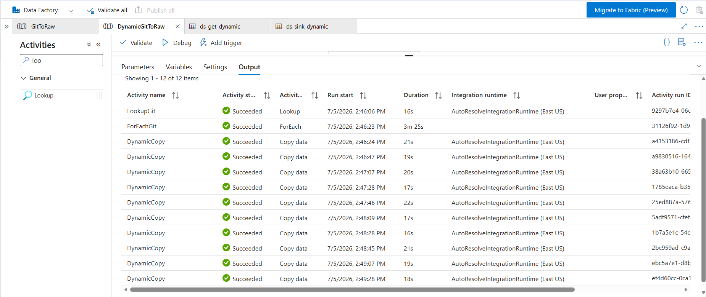
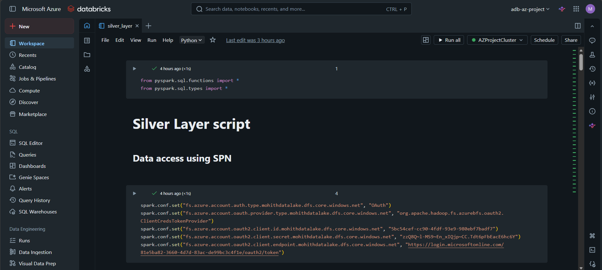
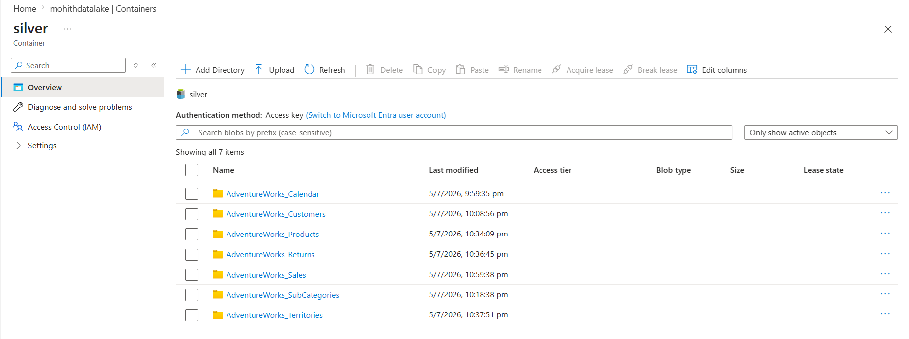
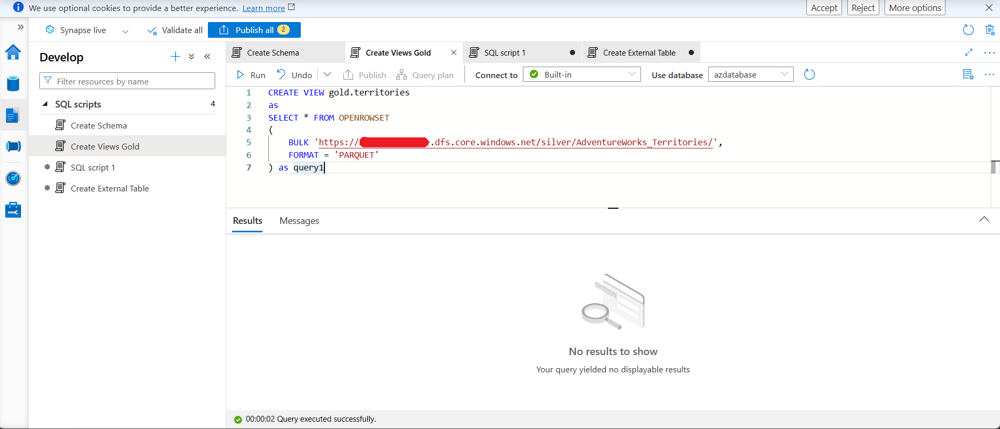
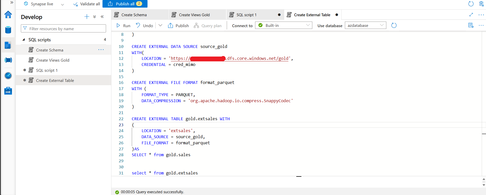
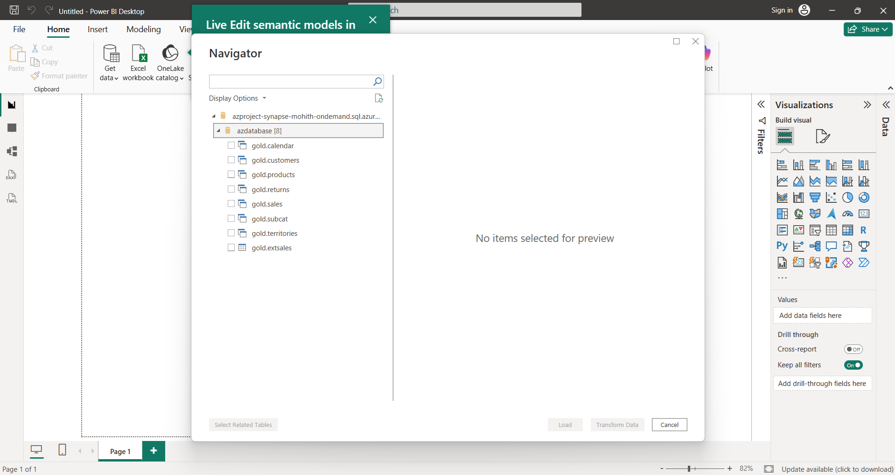
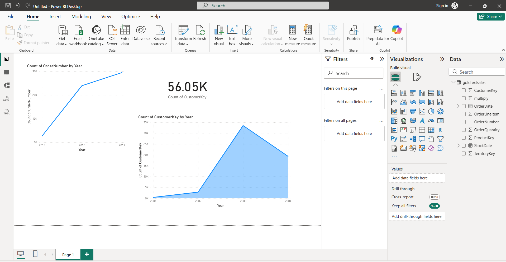

# Azure End-to-End Data Engineering Project

An end-to-end data engineering pipeline built on Microsoft Azure, following the
Bronze / Silver / Gold medallion architecture. Raw AdventureWorks CSV data is
pulled from a public GitHub repo, ingested with Azure Data Factory, cleaned
and transformed with Azure Databricks (PySpark), served through Azure Synapse
Analytics, and visualized in Power BI.

## Architecture

```
GitHub (raw CSVs)
        │  ADF HTTP linked service + dynamic ForEach/Copy
        ▼
   Bronze container (ADLS Gen2)
        │  Databricks (PySpark) — clean, cast types, derive columns
        ▼
   Silver container (ADLS Gen2, Parquet)
        │  Synapse Serverless SQL — OPENROWSET views + external tables
        ▼
   Gold layer (Synapse views / external tables)
        │
        ▼
     Power BI dashboard
```

## Data Source

Raw CSV files (AdventureWorks sample data — Calendar, Customers, Products,
Product Categories/Subcategories, Returns, Sales, Territories) are hosted at:
[veermohi/azure_data_engineering_project/Data](https://github.com/veermohi/azure_data_engineering_project/tree/main/Data)

## Azure Resources Used

| Resource | Purpose |
|---|---|
| Azure Data Factory | Orchestrates ingestion of raw CSVs from GitHub into the Bronze layer |
| Azure Data Lake Storage Gen2 | Stores Bronze (raw), Silver (cleaned), and Gold (curated) data |
| Azure Databricks | PySpark notebooks for Bronze → Silver transformations |
| Azure Synapse Analytics (Serverless SQL Pool) | Gold-layer views and external tables over Silver/Gold data |
| Power BI | Connects to Synapse for dashboards and reporting |

See [`docs/screenshots/01_resource_group_overview.png`](docs/screenshots/01_resource_group_overview.png)
for the full list of resources provisioned in the resource group.

## Steps Performed

### 1. Data Ingestion (Azure Data Factory)
- Created an **HTTP linked service** pointing at `raw.githubusercontent.com` to
  pull the AdventureWorks CSVs directly from GitHub.
- Built parameterized datasets (`ds_get_dynamic` for the HTTP source,
  `ds_sink_dynamic` for the ADLS Gen2 Bronze sink) so a single dataset
  definition could serve every file.
- Used a **Lookup** activity (`LookupGit`) to read a parameters file
  ([`adf/pipelines/git_parameters.sample.json`](adf/pipelines/git_parameters.sample.json))
  listing each source URL, sink folder, and file name.
- Wrapped a **Copy** activity in a **ForEach** loop (`ForEachGit` →
  `DynamicCopy`) driven by that lookup, so every file is copied into its own
  folder under the `bronze` container in a single dynamic pipeline
  (`DynamicGitToRaw`) — see
  [`adf/pipelines/DynamicGitToRaw.json`](adf/pipelines/DynamicGitToRaw.json).
- Verified the pipeline run: all 12 activities (1 Lookup + 1 ForEach + 10
  Copy operations) succeeded.

  

### 2. Data Transformation (Azure Databricks — Bronze → Silver)
- Authenticated to ADLS Gen2 from Databricks using a **Service Principal**
  (OAuth client credentials flow).
- Loaded each Bronze CSV into a Spark DataFrame with `inferSchema`.
- Applied layer-specific cleaning, for example:
  - **Calendar** — derived `Month` and `Year` columns from `Date`.
  - **Customers** — built a single `fullName` column from `Prefix`,
    `FirstName`, `LastName`.
  - **Products** — cleaned `ProductSKU` and `ProductName` by splitting on
    delimiters.
  - **Sales** — cast `StockDate` to a timestamp, normalized `OrderNumber`,
    and derived a `multiply` column (`OrderLineItem` × `OrderQuantity`).
- Wrote every transformed DataFrame back to the **Silver** container in
  Parquet format.
- Full script: [`databricks/silver_layer_transformation.py`](databricks/silver_layer_transformation.py).

  
  

### 3. Data Warehousing (Azure Synapse Analytics — Silver → Gold)
- Created a `gold` schema in the Synapse Serverless SQL database
  ([`synapse/create_schema.sql`](synapse/create_schema.sql)).
- Created **views** over the Silver Parquet files using `OPENROWSET`
  ([`synapse/create_views_gold.sql`](synapse/create_views_gold.sql)), e.g.
  `gold.territories`, `gold.sales`, `gold.customers`, etc.
- Created an **external data source**, **external file format**, and an
  **external table** (`gold.extsales`) backed by the Gold container
  ([`synapse/create_external_table.sql`](synapse/create_external_table.sql)).

  
  


### 4. Reporting (Power BI)
- Connected Power BI Desktop to the Synapse **Serverless SQL endpoint**
  (`azproject-synapse-<name>-ondemand.sql.azuresynapse.net`) and loaded the
  `gold.*` views as a live semantic model.
- Built visuals on top of the `gold.extsales` table — e.g. order counts and
  customer counts by year — to explore sales trends.

  
  

## Repository Structure

```
azure-e2e-data-engineering/
├── README.md
├── adf/
│   └── pipelines/
│       ├── DynamicGitToRaw.json        # ADF pipeline: GitHub → Bronze
│       └── git_parameters.sample.json  # Sample lookup parameters (source/sink mapping)
├── databricks/
│   └── silver_layer_transformation.py  # Bronze → Silver PySpark transformations
├── synapse/
│   ├── create_schema.sql               # Creates the "gold" schema
│   ├── create_views_gold.sql           # OPENROWSET views over Silver data
│   └── create_external_table.sql       # External data source, file format & table
├── powerbi/                             # (Optional) .pbix file goes here
└── docs/
    └── screenshots/                    # Screenshots documenting each step
```

## Notes

- All connection strings, storage account names, client secrets, and tenant
  IDs in this repo are placeholders (`<datalake>`, `<storage_account>`,
  `<client_id>`, etc.) — replace them with your own values, ideally sourced
  from **Azure Key Vault** rather than hardcoded.
- This project was inspired by common "Azure End-to-End Data Engineering"
  tutorial patterns using the AdventureWorks sample dataset.
